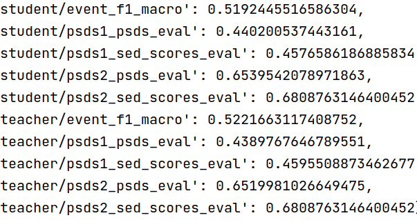
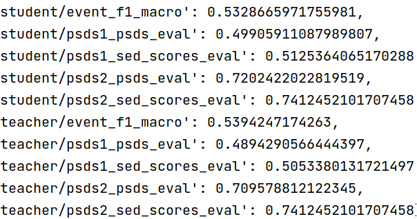

# Sound Activity-aware Based Cross-task Collaborative Training for Semi-supervised Sound Event Detection

## Introduction

 Briefly, we introduced a Sound Occurrence and Overlap Detection (SOD) task that captures patterns of sound activity to identify non-overlapping or overlapping sounds. And we propose a cross-task collaborative training framework that leverages the relationship between SED and SOD to improve semi-supervised training.
 
<figure>
 
 <figcaption>Fig. 1. Overall architecture of the proposed method. The superscripts s and t in the output results denote the student model and teacher model, respectively. During the test stage, the SOD branch can be omitted to reduce the computation and storage resources.</figcaption>
</figure>

## Get started

1. To reproduce our experiments, please first ensure you have the DESED dataset. To download the dataset, please refer to 
[DCASE Task 4 baseline](https://github.com/DCASE-REPO/DESED_task/tree/master/recipes/dcase2023_task4_baseline) Please note that the datasets of Dcase Task 4 in different years are slightly different. The dataset we used is from Dcase 2021.

2. Ensure you have the correct environment. The script `conda_create_environment.sh` is available to create an environment that runs the following code (recommended to run line by line in case of problems).

3. Change all required paths in `confs/sed.yaml` to your own paths.

## Train model

Run the command `python train_sed.py`  to train the model. 

## Test the trained model

We provide a [trained model](https://drive.google.com/file/d/1YSebKJ6gbGAri3wXPNEUHW2rKRGMg2nY/view?usp=sharing). The model can be tested using the following command: `python train_sed.py --test_from_checkpoint YOUR_CHECKPOINT_PATH`

### Results of trained model uploaded on Validation dataset:

### Results of trained model uploaded on Eval Public dataset:

## Contact

Please contact Yadong Guan at guanyadonghit@gmail.com for any query.
